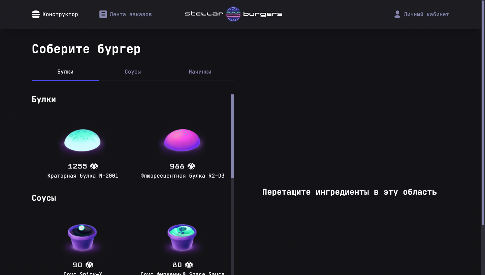

# React Burger 🍔

<a href="https://pdrobyshev.github.io/react-burger/">
    <h3>
        <a href="https://fruitoninja.herokuapp.com/">Сайт проекта React Burger</a>
    </h3>
</a>

React Burger - веб приложение для заказа космических бургеров.



На главной странице можно собрать бургер, перетаскивая желаемые ингредиенты в правую часть страницы - в специальную область.

Для возможности создания заказа - нужно зарегистрироваться или авторизоваться. Есть как общая лента заказов, так и для конкретного пользователя. Можно смотреть полную информацию как об отдельном ингредиенте, так и по конкретно взятому заказу. Ингредиенты в собранном бургере можно менять местами при помощи драг-н-дропа, то есть, перетаскивая их.

## Запуск проекта ⏯

Для запуска проекта вам необходимо открыть в корне проекта терминал и выполнить команду:

```javascript
npm i
```

После установки всех пакетов выполнить в терминале команду:

```javascript
npm start
```

## Стек технологий


<br>


<br>

<br>


<br>


<br>
